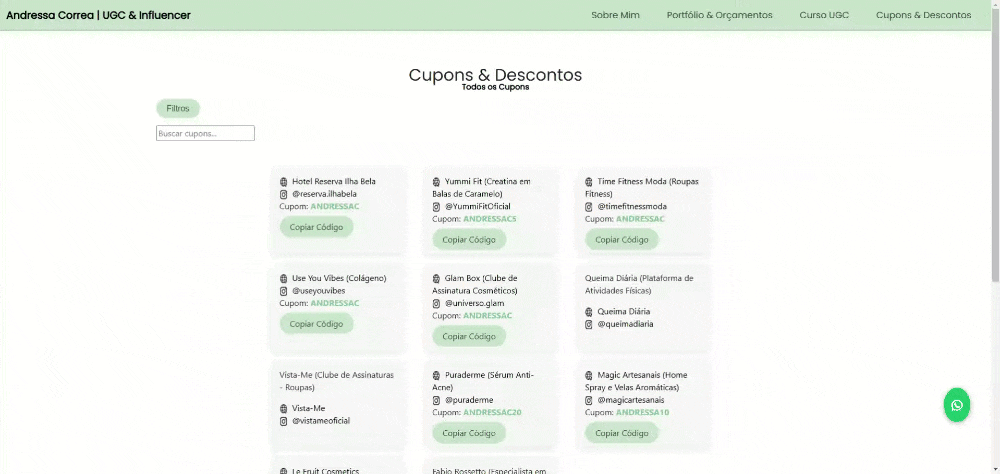

<h1 align="center">WEB-SITE ANDRESSA CORREA</h1>


<h2 align="center">Site desenvolvido para a criadora de conteúdo digital, Andressa Correa</h2>


<p align="center">A página foi desenvolvida, para divulgação e postagem de cupons e descontos.</p>

<p align="center">
    <a href="https://andressacorrea.lovestoblog.com">📱 Confira o Site</a>
</p>


Utilizei HTML e CSS em todas as funcionalidades e páginas, também como Bootstraps e paralax nas imagens do site


Na página de cupons, foi nescessário utilizar Java Script para o processo de cópia do código do cupom e mensagem de sucesso, e também no dropdown para filtro das categorias de cupons

```bash
// Função para filtrar cupons pela busca
function filterCoupons() {
    let searchTerm = document.getElementById('input-busca').value.toLowerCase();
    let coupons = document.querySelectorAll('.cupom');

    coupons.forEach(function(coupon) {
        let textContent = coupon.textContent.toLowerCase();
        if (textContent.includes(searchTerm)) {
            coupon.style.display = ''; 
        } else {
            coupon.style.display = 'none'; 
        }
    });
}
```



Na hospedagem, por ora, utilizo a plataforma [InfinityFree](https://dash.infinityfree.com/), que permite hospedagm gratuita, com certificado SSL como segurança


